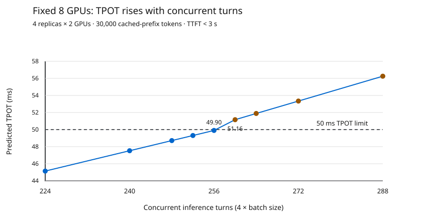
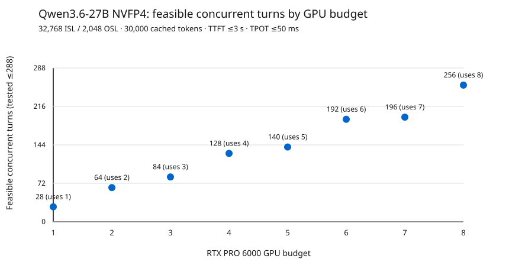

# Agentic/coding concurrency sweep

Predictions via ConfigIQ `http://localhost:3000/api/recommend` for `nvidia/Qwen3.6-27B-NVFP4` on
`rtx_pro_6000_server` (RTX PRO 6000 Blackwell Server Edition).

- Workload: 32,768 input tokens; 2,048 output tokens; 30,000 shared-prefix tokens (91.55% of input).
- Limits: TTFT ≤3,000 ms and non-inclusive TPOT ≤50 ms; vLLM and HYBRID database defaults.
- Requested target range 1–288; 100 target responses saved. Only `target_concurrency` varies; no GPU cap or `top_n` override.
- ConfigIQ's `recommendation.gpusNeeded` is the GPU count for each target; `performance.concurrency` is reported separately and is not the swept target.
- Reverse-mapped highest successful **target** for each GPU **budget**; actual GPUs can be lower. If the last target passes, capacity is only lower-bounded.
- Adjacent targets were checked at each GPU step. Untested targets between samples require the assumption that recommended GPU count does not decrease as requested concurrency increases.
- Sampled GPU counts were nondecreasing as target concurrency increased.
- Predictions are not p95 observations and exclude agent tool-wait time; a replay with warm shared prefixes is needed before claiming deployed capacity.
- An earlier direct public-gateway experiment returned contradictory results and was discarded; the parent README links here.

Sweep statuses: {'feasible': 100, 'infeasible': 0, 'error': 0, 'missing': 188}.

| GPU budget | Highest tested target | GPUs used | Mode | Replicas × GPUs | Reported concurrency | TTFT (ms) | TPOT (ms) | Note |
| ---: | ---: | ---: | --- | ---: | ---: | ---: | ---: | --- |
| 1 | 28 | 1 | agg | 1 × 1 | 28 | 734.0 | 48.4 | adjacent boundary checked; monotonicity assumed |
| 2 | 64 | 2 | agg | 1 × 2 | 64 | 679.0 | 49.9 | adjacent boundary checked; monotonicity assumed |
| 3 | 84 | 3 | agg | 3 × 1 | 84 | 734.0 | 48.4 | adjacent boundary checked; monotonicity assumed |
| 4 | 128 | 4 | agg | 2 × 2 | 128 | 679.0 | 49.9 | adjacent boundary checked; monotonicity assumed |
| 5 | 140 | 5 | agg | 5 × 1 | 140 | 734.0 | 48.4 | adjacent boundary checked; monotonicity assumed |
| 6 | 192 | 6 | agg | 3 × 2 | 192 | 679.0 | 49.9 | adjacent boundary checked; monotonicity assumed |
| 7 | 196 | 7 | agg | 7 × 1 | 196 | 734.0 | 48.4 | adjacent boundary checked; monotonicity assumed |
| 8 | 256 | 8 | agg | 4 × 2 | 256 | 679.0 | 49.9 | adjacent boundary checked; monotonicity assumed |

**Sampling:** 188 integer targets were not probed; 0 probes errored. The limits above are adjacent-boundary checked only when stated, not an exhaustive 1–288 sweep.

## Fixed eight-GPU TPOT ramp

The installed AISimulate 0.12.0 SDK's `cli_estimate` modeled four independent two-GPU replicas with 30,000 cached-prefix tokens. The repo's REST `/estimate` does not expose `prefix`, so this uses the installed SDK directly.
The two-GPU replica at batch 64 reproduces the `/recommend` result (678.991 ms TTFT, 49.903 ms TPOT). All estimates use the raw recommendation's `gemm=fp8_static`, `kvcache=fp8`, `fmha=bfloat16` settings. **Caution:** despite the NVFP4 model ID, the estimator reports FP8-static GEMM; these results do not verify NVFP4-kernel performance.

| Batch per 2-GPU replica | 4-replica capacity | TTFT (ms) | TPOT (ms) | TPOT ≤50 ms? |
| ---: | ---: | ---: | ---: | :---: |
| 56 | 224 | 663.341 | 45.143 | Yes |
| 60 | 240 | 671.300 | 47.523 | Yes |
| 62 | 248 | 675.177 | 48.713 | Yes |
| 63 | 252 | 677.092 | 49.308 | Yes |
| 64 | 256 | 678.991 | 49.903 | Yes |
| 65 | 260 | 680.876 | 51.161 | No |
| 66 | 264 | 682.747 | 51.888 | No |
| 68 | 272 | 686.449 | 53.343 | No |
| 72 | 288 | 693.702 | 56.251 | No |

With this topology, 256 simultaneous turns mean 64 on each replica. At 257, at least one of four replicas must handle 65, whose predicted TPOT is 51.161 ms, above the hard 50 ms constraint. This is a per-replica worst-case constraint, **not** a measured p95 service-level claim.
The `/recommend` result for target 257 changes to 10 GPUs (5 × 2) and retains 49.903 ms TPOT; it does not report TPOT on the fixed eight-GPU topology above 256.

See `fixed_eight_gpu_tpot.csv` and rerun `services/aisimulators/.venv/bin/python3 scripts/fixed_eight_gpu_tpot.py` to reproduce the fixed-topology curve.

See `probes.csv` for the 288 target slots (missing rows were not probed) and `raw_in_scope.jsonl` for saved ConfigIQ responses.

Regenerate (resumes existing successful/422 responses): `python3 scripts/sweep_agentic_concurrency.py --end 288`.
